# Canonical Quantization Error Analysis

## What this is

When we quantize a neural network's weights, each layer introduces a small
error. These errors compound through the network. This document reports
experiments measuring that compounding, decomposing it into sources, and
testing whether an oracle correction can eliminate it.

All experiments use MLPs (2→8→...→8→1) trained on the moons dataset with
4-bit delta quantization (5000 epochs, Adam optimizer). The analysis code
lives in `aleph/qgeom/canonical.py` and the notebook in
`notebooks/canonical_error_correction.py`.

## Quantization method

We use **delta (grid) quantization**: snap each weight to the nearest
multiple of a fixed step size δ.

$$W_q = \text{round}(W / \delta) \cdot \delta$$

With 4 bits, δ = 1/(2³) = 0.125. The maximum per-weight error is δ/2 =
0.0625. The quantization error matrix is E_L = W_q - W.

We chose delta quantization over bit-width quantization (which scales
per-tensor or per-channel) because it's more geometric: the error is a
uniform grid displacement, making it easier to reason about spatially. The
framework itself is quantization-agnostic — all classes take W and W_q as
inputs and never call `quantize()`. The same analysis applies to any
quantization method; we just need to swap how W_q is produced.

Biases are kept at full precision. They cancel in the error formula:
ẑ - z = (W_q·â + b) - (W·a + b) = E·â + W·ε.

## The framework

### Error decomposition

At each layer, the pre-activation error is:

$$\hat{z}_L - z_L = \underbrace{E_L \cdot \hat{a}_{L-1}}_{\text{local}} + \underbrace{W_L \cdot \varepsilon_{L-1}}_{\text{propagated}}$$

- **Local**: this layer's quantization error E_L applied to the (quantized)
  input activations. Present even if all previous layers were perfect.
- **Propagated**: the float weight matrix W_L amplifying accumulated error
  ε_{L-1} from all previous layers.
- Computed exactly as `propagated = total - local` (no approximations).

### Canonical space

Errors at different layers have different dimensions (2D input, 8D hidden,
1D output). To compare them, we map everything back to input space via the
pseudoinverse of the cumulative transform T_L = W_L ⋯ W_1:

$$\text{canonical error} = T_L^+ \cdot \text{output error}$$

This is a linear approximation — it ignores ReLU nonlinearities, so it's
exact for the linear component and approximate for the rest.

### Perfect (oracle) correction

At each layer, apply: C_L = -E_L · â_{L-1} - W_L · ε_{L-1}

This exactly undoes both local and propagated error, recovering the float
pre-activation: ẑ_L + C_L = z_L. It's an oracle because it needs the float
activations to compute ε_{L-1}.

### ReLU disagreement

Where sign(z_float) ≠ sign(z_quant), the quantized and float networks make
different on/off decisions. This is the only source of nonlinear error — and
the one thing perfect correction can't fix in general (though it does fix it
when we correct at every layer, since then pre-activations match exactly).

## Results by depth

All models trained with seed=42, 5000 epochs, Adam. Depth 16 requires
lr=0.005 (lower than the default lr=0.01) to converge.

### Depth 2 (3 layers: 2→8→8→1)

**Float accuracy**: 99.8%

| Layer | Shape  | Local  | Propagated | Total  | % Propagated |
|-------|--------|--------|------------|--------|--------------|
| L0    | (8,2)  | 0.1198 | 0.0000     | 0.1198 | 0%           |
| L1    | (8,8)  | 1.1958 | 0.6026     | 1.5211 | 34%          |
| L2    | (1,8)  | 0.5785 | 7.7729     | 8.2966 | 93%          |

Correction residual: ~10⁻⁶ at every layer (float32 precision).

Partial correction:
- Output layer only (L2) → 0.0000 (bottleneck absorbs everything)
- Middle layer only (L1) → 0.6007
- Layer 0 only → 4.0887
- No correction → 8.2966

ReLU disagreement: 0.7% (L0), 4.6% (L1).

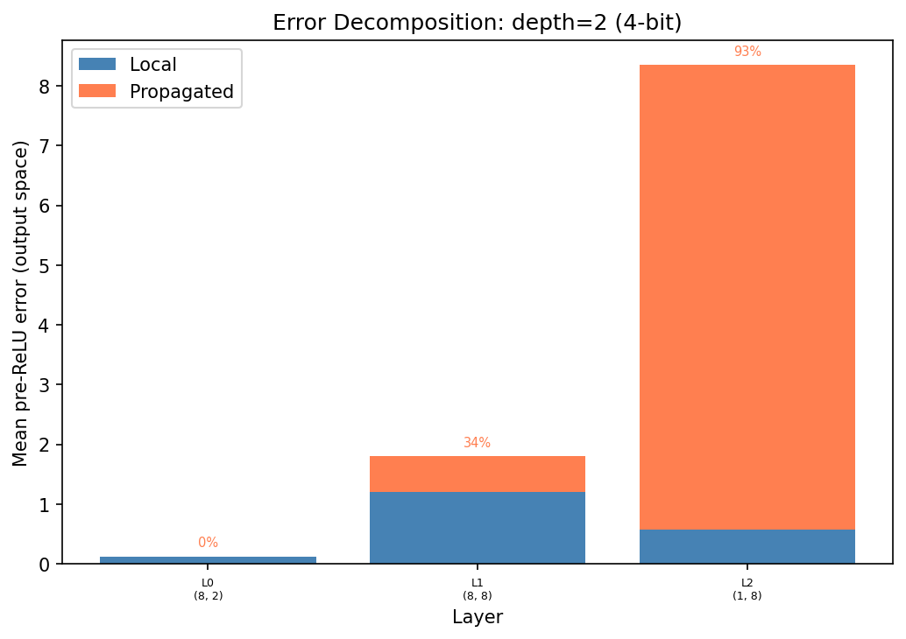
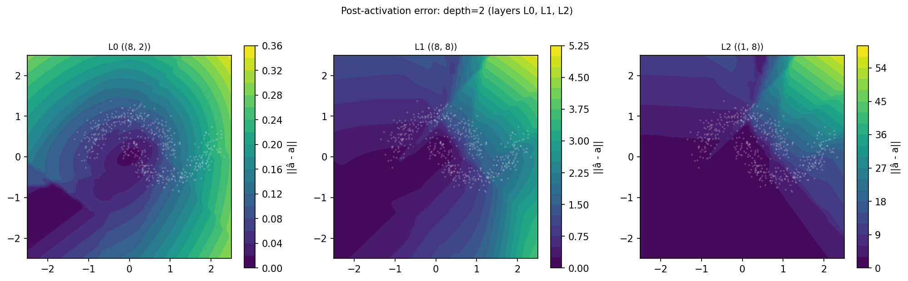
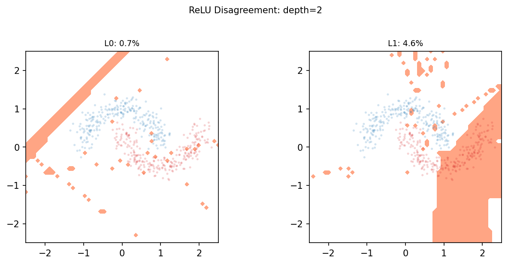

### Depth 4 (5 layers: 2→8→8→8→8→1)

**Float accuracy**: 100%

| Layer | Shape  | Local  | Propagated | Total  | % Propagated |
|-------|--------|--------|------------|--------|--------------|
| L0    | (8,2)  | 0.1246 | 0.0000     | 0.1246 | 0%           |
| L1    | (8,8)  | 0.3975 | 0.1279     | 0.4252 | 24%          |
| L2    | (8,8)  | 0.6633 | 1.2079     | 0.9261 | 65%          |
| L3    | (8,8)  | 1.6302 | 2.4689     | 2.2597 | 60%          |
| L4    | (1,8)  | 0.1401 | 1.3722     | 1.4110 | 91%          |

Propagated error dominates by L3-L4. Total error grows from 0.12 to 1.41
(~12x amplification across 5 layers).

Correction residual: ~10⁻⁷ at every layer.

Partial correction:
- Output layer only (L4) → 0.0000
- Layer 0 only → 0.6591
- Middle layer only (L2) → 1.2371
- No correction → 1.4110

ReLU disagreement: 0.8–3.4% per layer.

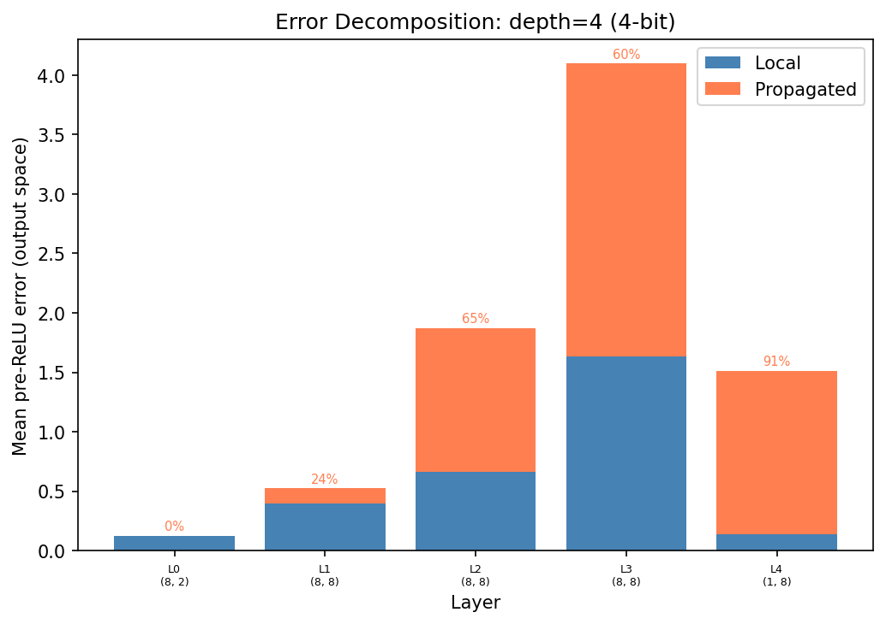
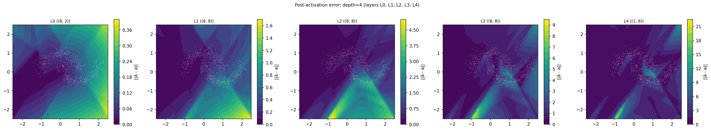
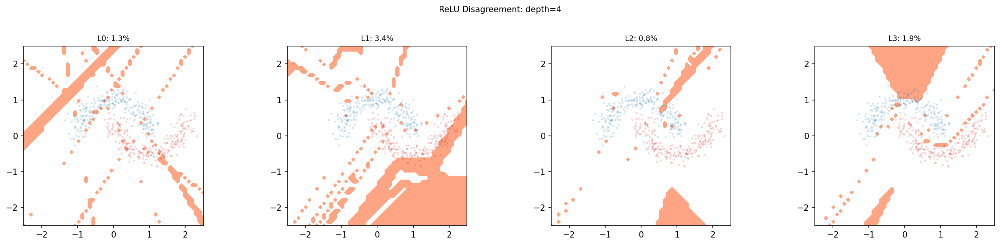

### Depth 8 (9 layers: 2→8×8→1)

**Float accuracy**: 100%

| Layer | Shape  | Local  | Propagated | Total  | % Propagated |
|-------|--------|--------|------------|--------|--------------|
| L0    | (8,2)  | 0.1153 | 0.0000     | 0.1153 | 0%           |
| L1    | (8,8)  | 0.2848 | 0.1377     | 0.3486 | 33%          |
| L2    | (8,8)  | 0.1432 | 0.2481     | 0.2583 | 63%          |
| L3    | (8,8)  | 0.2774 | 0.1933     | 0.3152 | 41%          |
| L4    | (8,8)  | 0.2623 | 0.3716     | 0.4918 | 59%          |
| L5    | (8,8)  | 0.3080 | 1.0051     | 1.0186 | 77%          |
| L6    | (8,8)  | 0.6589 | 2.0572     | 2.3804 | 76%          |
| L7    | (8,8)  | 1.5719 | 5.2239     | 6.0907 | 77%          |
| L8    | (1,8)  | 1.3583 | 9.7492     | 8.4824 | 88%          |

Error grows from 0.12 to 8.48 (~70x). The growth is not monotone — it's
slow in the early layers (L0-L4) where weight spectral norms are modest
(||W||₂ ≈ 1.6–3.1), then accelerates dramatically at L5 where one layer has
||W||₂ = 8.0 (a large spectral norm amplifies both signal and error).

**Error drops from L7 (6.09) to L8 (8.48 total, but uncorrected post-act
is 8.48 vs L7's 5.70)**. Wait — the total error does continue growing, but
the output layer projects 8D→1D, so only the component of the 8D error
aligned with W₈ reaches the output. The 7 orthogonal dimensions are
discarded.

**Condition numbers blow up**: cond(T₈) = 5089. The cumulative transform
becomes ill-conditioned with depth. The correction formula is unaffected (it
operates in output space), but canonical space comparisons get unreliable.

**ReLU disagreement spikes**: L5=21%, L6=16%, L7=31%. The deeper layers with
large weight norms cause more neurons to flip sign. This is a qualitative
shift — at depth 2–4, disagreement stays under 5%.

Partial correction:
- Output layer only (L8) → 0.0000 (still works)
- Middle layer only (L4) → 0.1954
- Layer 0 only → 5.8101
- No correction → 8.4824

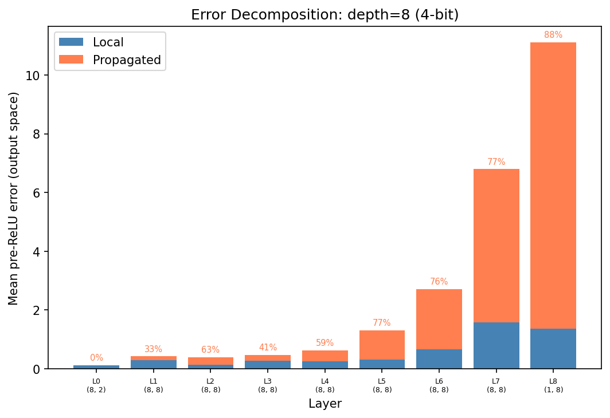
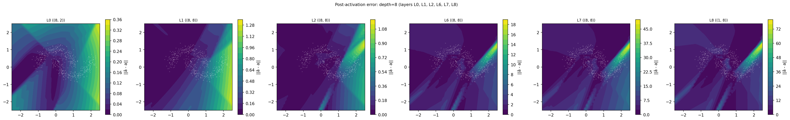
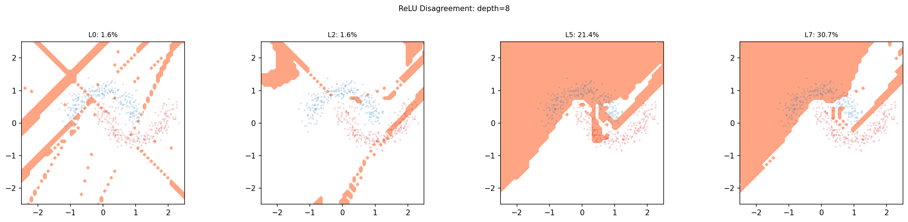

### Depth 16 (17 layers: 2→8×16→1)

**Float accuracy**: 100% (requires lr=0.005; lr=0.01 fails to converge)

| Layer | Shape  | Local  | Propagated | Total  | % Propagated |
|-------|--------|--------|------------|--------|--------------|
| L0    | (8,2)  | 0.1009 | 0.0000     | 0.1009 | 0%           |
| L1    | (8,8)  | 0.1708 | 0.0486     | 0.1859 | 22%          |
| L2    | (8,8)  | 0.1016 | 0.1592     | 0.2098 | 61%          |
| ...   |        |        |            |        |              |
| L8    | (8,8)  | 0.2904 | 0.2905     | 0.4624 | 50%          |
| ...   |        |        |            |        |              |
| L12   | (8,8)  | 0.7596 | 2.4135     | 2.7087 | 76%          |
| L13   | (8,8)  | 1.6846 | 2.6688     | 3.1644 | 61%          |
| L14   | (8,8)  | 3.3446 | 2.5405     | 4.9626 | 43%          |
| L15   | (8,8)  | 2.3092 | 8.5290     | 9.7620 | 79%          |
| L16   | (1,8)  | 1.5217 | 8.7703     | 9.8629 | 85%          |

Error grows from 0.10 to 9.86 (~100x across 17 layers). The pattern
is qualitatively different from shallower networks:

1. **Slow start, fast finish**: error stays below 0.5 for the first 8
   layers, then ramps exponentially in L12-L16. The network learned
   small weight norms early (||W||₂ ≈ 1.4–2.1) and larger norms late
   (||W||₂ up to 4.9 at L12).

2. **Local error sometimes dominates late layers**: L14 has only 43%
   propagated — the local error (3.34) exceeds propagated (2.54). This
   happens when a layer has both large quantization error and large
   activations to multiply it against.

3. **Condition numbers become extreme**: cond(T₁₅) = 2.9M. Canonical
   space mapping is numerically meaningless at this depth. The correction
   formula still works (residual ~10⁻⁶) because it never uses the
   canonical transform.

4. **ReLU disagreement reaches 14% at L14**. Still spatially structured
   but more widespread than at shallower depths.

Partial correction:
- Output layer only (L16) → 0.0000 (still works!)
- Layer 0 only → 8.97 (negligible improvement)
- Middle layer only (L8) → 9.10 (negligible improvement)
- No correction → 9.86

Output-layer-only correction continues to work because the (1,8) bottleneck
discards 7 of 8 error dimensions. However, single-layer correction at any
*interior* layer is now nearly useless — the error from other layers
dominates.

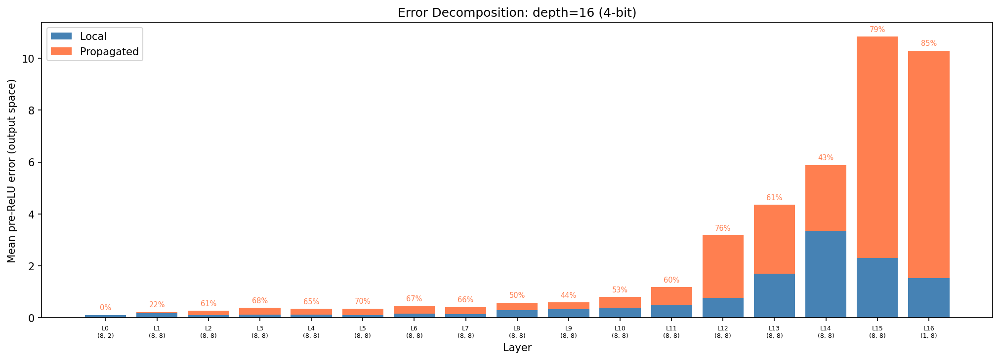
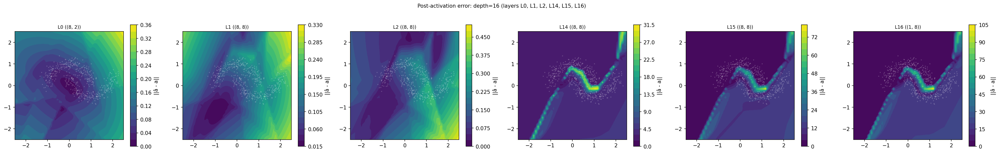
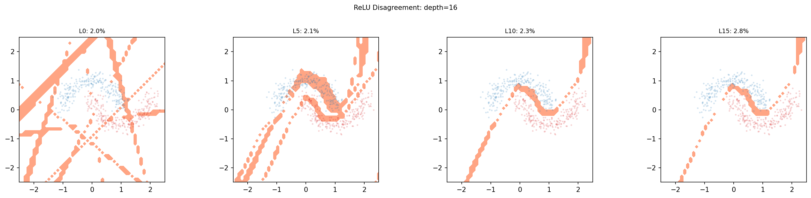

## How to read the plots

### Attribution bar chart

Stacked bars showing mean pre-ReLU error (output space) at each layer.
**Blue** = local error (this layer's quantization). **Orange** = propagated
error (upstream quantization errors amplified forward). The percentage label
shows the propagated fraction. A growing orange fraction means earlier
quantization mistakes are increasingly dominating.

### Error heatmap

Each panel shows one layer. The x/y axes are input space coordinates; the
color is **output-space** error magnitude ||â_L - a_L|| at that layer (not
canonical space — the dimensions differ per layer). White dots are training
data. Error concentrates away from the training data because the network
extrapolates large activations outside the data manifold, and larger
activations → larger quantization error. The color scale grows across panels
(check the colorbars) — this is the compounding.

### ReLU disagreement map

Red regions = at least one neuron at that layer made a different on/off
decision in the quantized vs float network. These are inputs where
sign(z_float) ≠ sign(z_quant) for some neuron. They cluster near the
network's decision boundaries where neurons are close to zero. Low overall
rate (1–5% at 4-bit for shallow networks, up to 30% for deep) but spatially
structured.

## Key findings

### 1. Error compounds, driven by weight spectral norms

In trained networks (depth 2–16), propagated error grows from 0% at layer 0
to 85–93% at the output. Total error grows roughly exponentially with depth.
The rate depends on ||W_L||₂: layers with ||W||₂ > 3 cause sharp jumps
(e.g., depth-8 L5 with ||W||₂ = 8.0 causes a 2x error increase in one
step), while layers with ||W||₂ ≈ 1.5 grow slowly.

### 2. Perfect correction works exactly at all depths

The correction formula C_L = -E_L·â - W_L·ε recovers float pre-activations
to float32 machine precision (~10⁻⁶ to 10⁻⁷) at every layer, for every
depth tested (2 through 16). This confirms the math: quantization error is
fully characterized by the local + propagated decomposition.

### 3. Bottleneck layers absorb upstream error

Correcting only the output layer (8→1) achieves near-zero output error at
every depth tested, including depth 16. The rank-1 projection discards the
7 dimensions of accumulated 8D error orthogonal to the output weight vector.

This generalizes: any wide→narrow transition is a natural error absorption
point. Correction effort should concentrate at bottlenecks.

However, single-interior-layer correction becomes useless at depth 16 —
correcting L8 alone reduces error from 9.86 to 9.10 (7% improvement). In
deep networks, you need either the bottleneck trick or correction at many
layers.

### 4. Error is spatially structured, not random noise

The error heatmaps show that quantization error concentrates in specific
spatial regions (large activations, typically away from training data). The
canonical-space PCA analysis shows >99% of error variance along a single
direction — the quantization grid imposes a preferred error direction.

This structure is good news for learned corrections: a correction network
doesn't need to handle arbitrary noise, just a structured, low-rank
perturbation.

### 5. ReLU disagreement grows with depth

At depth 2–4, disagreement is 1–5% and localized near decision boundaries.
At depth 8, it spikes to 21–31% in the later layers. At depth 16, most
layers stay under 5% but a few hit 14%. These are the hard cases for any
non-oracle correction — where the quantized network makes fundamentally
different routing decisions.

### 6. Canonical space degrades with depth

The condition number of T_L grows exponentially: from ~2 at L0 to 5000 at
depth 8 and 2.9M at depth 16. Canonical space error comparisons become
numerically meaningless beyond ~5 layers. The correction formula is
unaffected because it operates in output space, not canonical space.

### 7. Experimental setup limits

The 2D moons task with width-8 networks is useful for geometric
visualization but limited: the 2D input manifold lives in a thin subspace
of the 8D hidden representation. In practical networks where input
dimension ≈ hidden dimension, the effective rank would be higher and
compounding patterns may differ. Deep networks (depth ≥ 16) also require
learning rate tuning to converge, adding a confound.

## What's next

The oracle correction proves the theoretical ceiling — 100% of quantization
error is correctable (where ReLU agrees). The open question is efficiency:
can we replace the oracle (which needs float activations) with a learned
correction that achieves most of the benefit using only quantized
activations? The canonical space framework identifies where to focus that
correction (bottleneck layers, high-error spatial regions).
