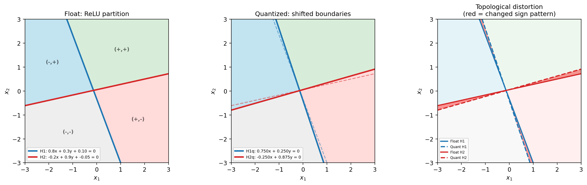
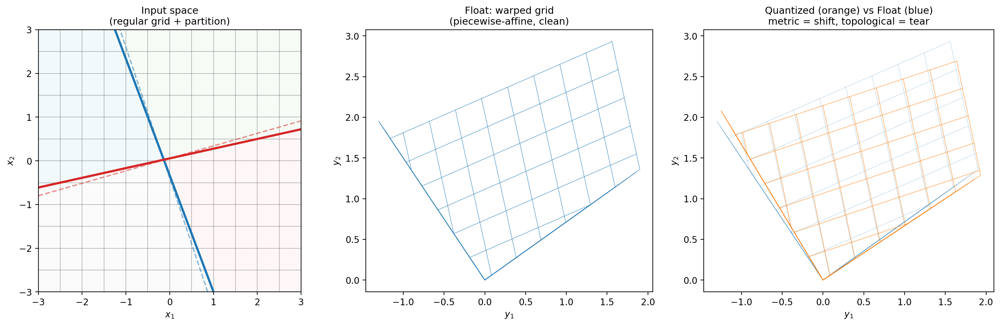
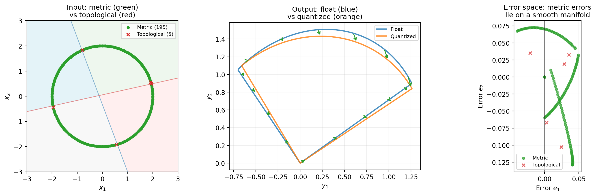
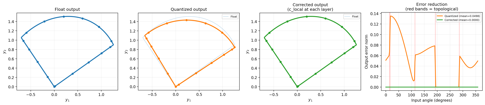
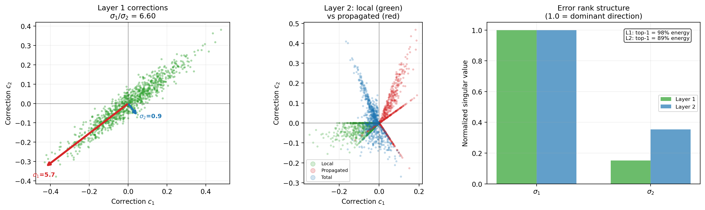

# Geometric Quantization Error Correction

*Informal research brief — assumes linear algebra and geometry, not quantization.*


## What quantization does to a network

A neural network with ReLU activations is a **piecewise-linear function**. Each ReLU creates a hyperplane that divides activation space in two (on/off). The collection of all ReLUs at a given layer partitions the input space into convex polyhedra — within each polyhedron, every ReLU has a fixed sign, so the network reduces to a single affine map.

Think of it as a Voronoi-like decomposition, but with flat cuts. Each polyhedron has its own linear transformation. The network's expressive power comes from having many such regions with different transformations.

**Quantization** snaps the weight matrices to a discrete grid (e.g., multiples of 1/8 for 4-bit). This does two things to the geometry:

1. **It distorts the affine maps.** Within each polyhedron, the transformation A changes to A' = A + E, where E is the quantization error matrix. The same region of input space gets mapped through a slightly wrong rotation/scaling. Imagine taking a mesh, and slightly perturbing every vertex of the mesh — the faces stretch and shear, but the connectivity (which vertex connects to which) stays the same.

2. **It moves the partition boundaries.** The hyperplanes w^T x = 0 shift to w_q^T x = 0. Some polyhedra grow, others shrink, and points near boundaries end up in the wrong region — processed by the wrong affine map entirely. In the mesh analogy: some faces flip orientation, edges cross, the topology changes.

We call (1) **metric distortion** and (2) **topological distortion**.

> **Fig 1**:
> 
> A 2→2→2 network with ReLU. Left: the float partition (4 sign-pattern regions). Center: quantized partition with shifted hyperplane boundaries (dashed = original). Right: the red bands where the partition changed — only 2.6% of input space.

## Why this decomposition matters

Metric distortion is **linearly correctable**. If you know A and A', you can compute the correction: undo A', apply A. Within each polyhedron, this is a fixed linear operation. In our experiments on MLPs (2D spirals, varying depth and width), metric distortion accounts for 88–98% of total error energy and correcting it alone recovers float-model accuracy across all configurations tested.

Topological distortion is **not linearly correctable**. A point processed by the wrong affine map cannot be fixed by adjusting the output of the wrong map — you'd need to detect that it crossed a boundary and re-route it. However, topological distortion is small (2–12% of error energy in our experiments) and largely task-irrelevant: it occurs near decision boundaries where the classification is ambiguous anyway.

This is analogous to the distinction in mesh deformation between: (1) stretching a triangle (changes the metric tensor, but the triangle is still a triangle — recoverable by a linear map), and (2) flipping a triangle's orientation (topological change — no continuous deformation fixes it).

> **Fig 2**:
> 
> A regular grid mapped through the float and quantized 2-layer networks. Panel B shows how the float network warps space — within each partition region, grid cells form clean parallelogram patches (piecewise-affine). Panel C overlays float (blue) and quantized (orange) grids: the smooth displacement between them is metric distortion (wrong affine map within each region), while tears/folds at the kink lines are topological distortion (changed piecewise-linear structure).

> **Fig 3**:
> 
> 200 points sampled on a circle through the 2-layer network. Left: input space colored by distortion type — 98% metric (green), 2% topological (red X). Center: float output manifold (blue) vs quantized (orange) with error arrows colored by type. Right: the error space — metric errors form a smooth curve, topological errors scatter off it. 97.4% of error energy is metric.

## Error propagation: composition of distortions

In a deep network, quantization error at layer L propagates to all subsequent layers. This is not additive — it's **compositional**. Each layer applies a slightly wrong transformation to an already-distorted input:

```
Layer 0:  x  -->  A'_0(x)           = A_0(x) + E_0(x)
Layer 1:  A'_0(x)  -->  A'_1(A'_0(x))  = A_1(A_0(x)) + [stuff that depends on E_0 AND E_1]
```

The cumulative distortion is a product of per-layer distortions, not a sum. This is why error amplifies exponentially with depth: in our 12-layer MLP experiments, a local error of 0.20 at layer 0 becomes 93.47 at layer 12 — a 470x amplification.

The correction at layer L must undo two things:
- **Local distortion**: E_L applied to the current activation (the wrong rotation/scaling at this layer)
- **Propagated distortion**: the accumulated error from all previous layers, now transformed through W_L

The oracle (perfect) correction is:

```
C_L = -E_L @ a_L  -  W_L @ epsilon_{L-1}
       ^^^^^^^^^^     ^^^^^^^^^^^^^^^^^^^^
       local          propagated (depends on all previous layers)
```

This is the **first-order inverse** of the distortion. It works because quantization errors are small enough that the linearized inverse is accurate (the second-order term E_L @ epsilon is negligible).

> **Fig 4**:
> 
> Float output vs quantized vs corrected (c_local at each layer pre-ReLU). The corrected manifold (green) perfectly overlaps float (blue). The error reduction panel shows quantized error up to 0.14 dropping to 0 after correction. In this 2-layer example, pre-ReLU correction cascades perfectly: correcting layer L gives layer L+1 the correct input, so its c_local is also exact.

## The correction problem

We want to train a small correction network that, at each layer, takes the (distorted) pre-activation and predicts what correction to apply. The correction undoes the geometric transformation — it's not subtracting a noise vector, it's inverting a distortion.

### What we know works (on fixed-width MLPs)

- **Direct local correction** c_local = -E_L @ a is cheap (we know E_L, we have a) and recovers float accuracy on fixed-width networks. This is the inverse of just the local distortion.
- **Learned correction networks** can additionally capture propagated error, beating c_local. Best architecture: a skip connection that adds c_local and lets a small network learn the residual (the propagated component).

### What breaks with variable-dimension architectures

Autoencoders (784 -> 256 -> 128 -> 32 -> 128 -> 256 -> 784) and transformers (128 -> 512 -> 128 -> ...) have layers of different dimensions. c_local alone no longer recovers float performance because:
- Bottleneck layers compress the signal, projecting error into a lower-dimensional space where information is lost
- Expansion layers amplify error components that were harmless in the compressed space
- The composition of compress-then-expand creates error structure that local correction cannot address

> **Fig 5**:
> 
> SVD of oracle corrections. Layer 1 corrections are highly anisotropic (sigma ratio 6.6, top-1 captures 98% energy). Layer 2 shows local (green) vs propagated (red) correction components — propagated accounts for 59% of energy even at depth 2. The low-rank structure means corrections are concentrated in 1–2 directions.

## The error space and its geometry

At each layer L, the oracle corrections for a dataset of N points form a matrix C_L of shape (N, d_L). This matrix has structure:

- **Within a single polyhedron**: all corrections are linear in the input activation. They form a linear subspace of R^{d_L}, with dimension at most rank(E_L).
- **Across polyhedra**: different polyhedra contribute different linear subspaces. The overall correction matrix C_L is a union of linear patches — a piecewise-linear manifold.

The SVD of C_L reveals this structure:
- **Large singular values**: the dominant metric distortion directions, shared across most polyhedra. These capture the "average" rotation/scaling error.
- **Small singular values**: corrections specific to individual polyhedra or boundary effects. These are the topological component plus data-point-specific metric variations.

The number of significant singular values is the **intrinsic dimensionality of the correctable error** at layer L. In our MLP experiments, this is surprisingly small (rank 2 captures 95% of correction energy, though task recovery requires rank 5+).

## Proposed correction architecture

The geometric picture suggests a specific architecture. At each layer L:

**Pre-computed (offline, from calibration data):**
- Run float and quantized models on calibration set
- Compute oracle corrections at each layer
- SVD each layer's corrections to get V_L (d_L x k): the principal distortion directions

**At inference:**
```
a = activation from previous layer
z = W_q @ a + b                              (quantized pre-activation)
c_local = -E_L @ a                           (local inverse distortion, cheap)

alpha = V_L^T @ c_local                      (project local error onto distortion basis: k scalars)
beta  = f(alpha, layer_embed)                 (tiny shared MLP predicts correction coefficients)
correction = V_L @ beta                       (project back to activation space)
z_corrected = z + correction                  (apply inverse distortion)
```

**What each component does geometrically:**
- V_L defines the principal axes of the distortion at layer L. It's the "error basis" — the directions in activation space where the transformation is most wrong.
- V_L^T @ c_local measures how the local distortion aligns with these principal axes. The k coordinates locate the current point on the error manifold.
- The MLP refines these coordinates, accounting for propagated error. It learns: "at layer 7, when the local distortion has this profile, the propagated distortion typically shifts the correction by this much."
- V_L @ beta maps back from the error manifold to activation space.

**Parameter cost:**
- V_L: pre-computed, not learned. d_L x k per layer. For GPT-2 (d=768, k=32, 24 FFN layers): ~590K stored values, 0.47% of model.
- Shared MLP: (k + embed_dim) -> hidden -> k. For k=32, embed=8, hidden=32: ~2.5K learned params.
- Layer embeddings: n_layers x embed_dim. ~200 params.

The correction network is 0.002% of the model. The stored bases are 0.47%.

## Open questions

### 1. What is the intrinsic dimensionality of the error?

How fast do the singular values of C_L decay? If the top 32 capture 99% of correction energy, k=32 works. If they decay slowly, we need large k and the approach may not scale. This has been measured for fixed-width MLPs (rank ~2 for energy, ~5 for task recovery) but not for transformers.

### 2. Does correcting metric distortion suppress topological distortion?

The strongest possible finding: if we correct the linear part of the error at layer L, activations stay closer to polyhedron interiors at layer L+1, so fewer points cross boundaries. This would mean per-layer metric correction has a cascading benefit — the nonlinear part stays small because we keep the activation trajectory inside the correct polyhedra. This would make the entire problem approximately linear.

### 3. How does the error basis evolve across layers?

Do the distortion directions V_L change from layer to layer? If the principal angles between V_0's column space and V_7's column space are small, the distortion has shared structure and we could reduce storage further (shared basis, per-layer rotation). If they're orthogonal, each layer's error geometry is independent.

### 4. Does per-block correction suffice for transformers?

In transformers, the residual connection means each block's error is additive to the residual stream (unlike MLPs where errors compose multiplicatively through matrix multiplication). This suggests per-block independent correction might work — each block's FFN always maps d_model -> d_ff -> d_model, so the correction in residual-stream space is always d_model-dimensional regardless of FFN expansion factor. The residual connection may naturally contain error propagation.

## Relation to existing work

The closest existing work is [LQER (ICML 2024)](https://arxiv.org/abs/2402.02446), which performs SVD on the quantization error matrix E = W - W_q with activation-aware scaling. Their finding: raw SVD needs rank ~600 (out of dim 2048) to recover performance, but activation-weighted SVD reduces this to rank 32–64. Their correction is in **weight space** (a low-rank additive correction to each weight matrix), while ours operates in **activation space** (a data-dependent correction at each layer). Activation-space correction is more expressive (it can adapt per data point) but requires inference-time computation.

[QEP (2025)](https://arxiv.org/abs/2504.09629) explicitly propagates quantization errors across layers and compensates for accumulated errors — the closest to our cross-layer analysis.

Our contribution relative to these: a **geometric decomposition** of quantization error into metric (linearly correctable) and topological (partition-changing) components, and the finding that metric correction alone recovers float accuracy — which motivates low-rank, low-parameter correction architectures.

## Experimental validation so far

| Finding | Configurations tested | Status |
|---|---|---|
| Error compounds exponentially with depth | MLP 2D/100D, depths 4-12, widths 8-32 | Confirmed |
| Propagated error dominates (88-98%) | Same | Confirmed |
| Metric correction alone recovers float accuracy | Same + moons dataset | Confirmed |
| Oracle correction residual ~1e-6 | All MLP configs | Confirmed |
| Direct c_local (0 learned params) recovers accuracy | Fixed-width MLPs | Confirmed |
| c_local insufficient for variable-dim architectures | Autoencoder (MNIST), transformer FFN | Confirmed |
| Learned correction with skip beats c_local | Fixed-width MLPs, autoencoders | Confirmed |
| SVD rank for energy vs task recovery diverge | Fixed-width MLPs | Confirmed |

**Next**: per-block correction analysis on transformers, measuring the 4 open questions above.
